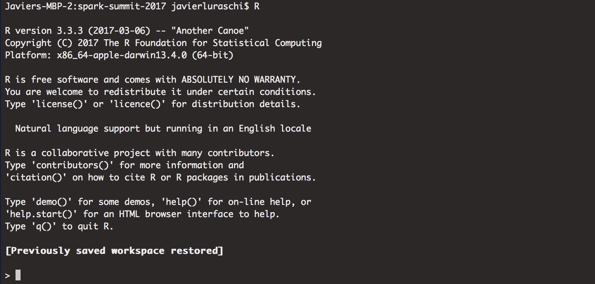
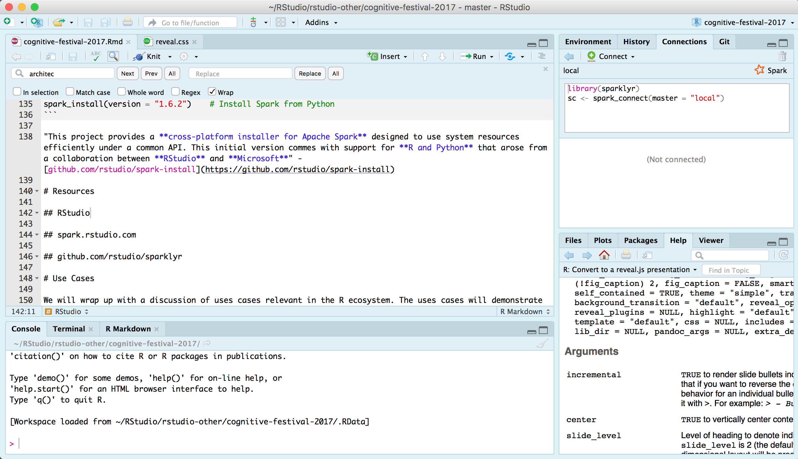
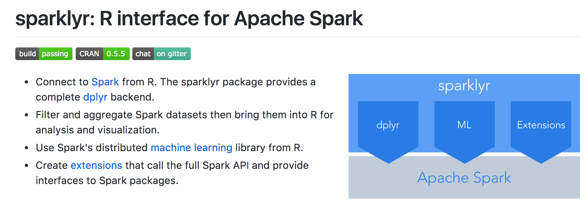
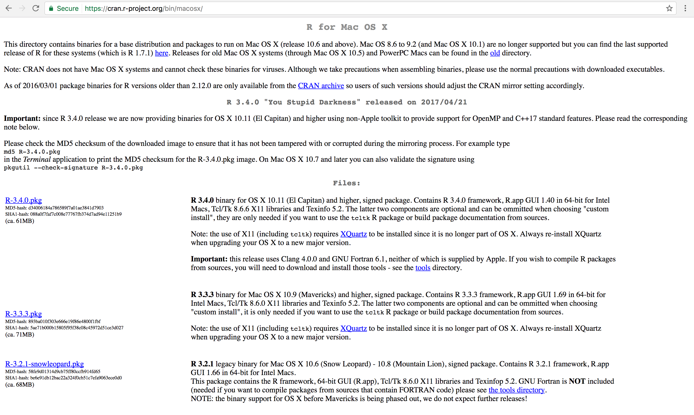
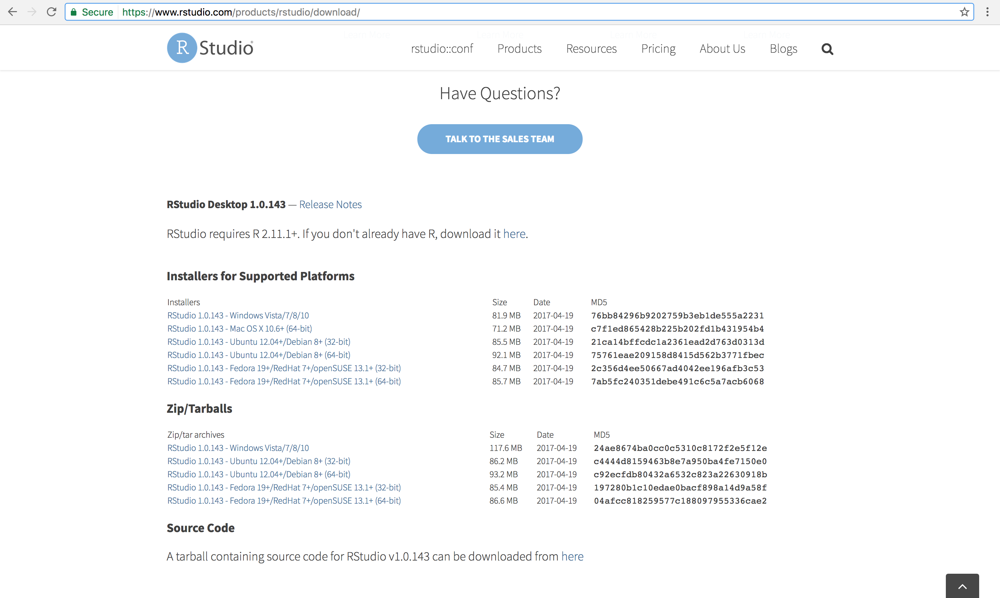
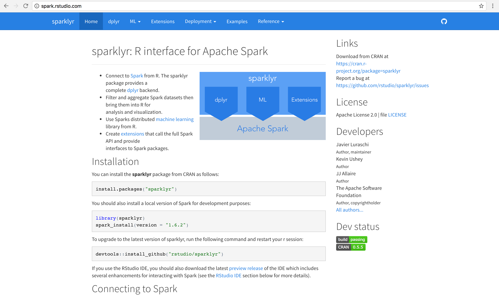
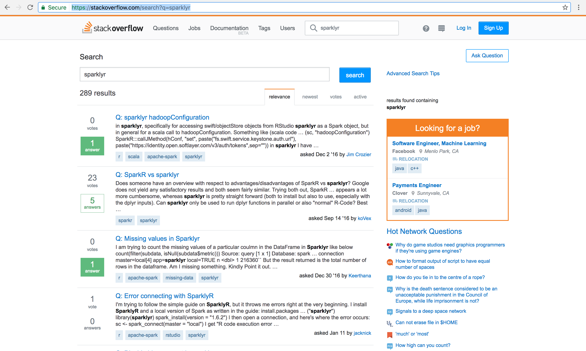
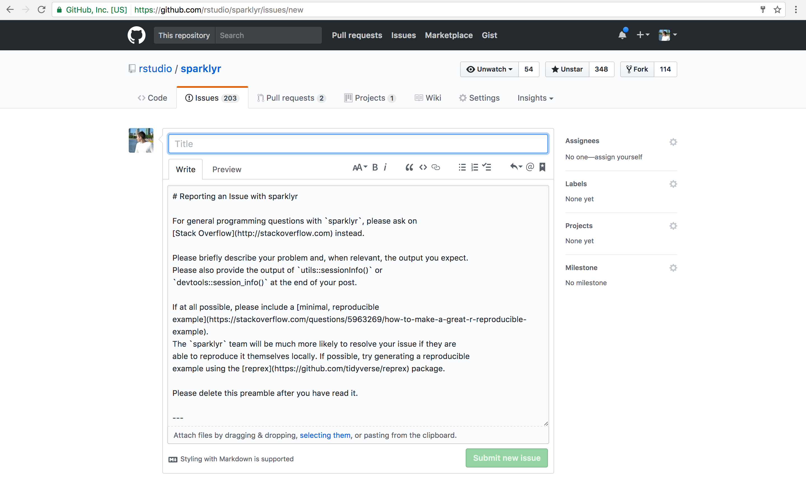

# Introduction

## What is R?
> R is an open source programming language and software environment for statistical computing



## What is RStudio?
> RStudio is a free and open-source integrated development environment (IDE) for R



## What is sparklyr?
> R interface for Spark



## Why sparklyr?

```{r eval=F}
install.packages("sparklyr")            # Install sparklyr
library(sparklyr)                       # Load sparklyr
```

```{r eval=F}
spark_install()                         # Install Apache Spark
sc <- spark_connect(master = "local")   # Connect to local instance
spark_web(sc)                           # Launch Spark UI
```

```{r eval=F, messages=F}
library(dplyr)                          # Data Manipulation Library
mtcars_tbl <- copy_to(sc, mtcars)       # Copy mtcars into Spark
count(mtcars_tbl)                       # Count records

ml_linear_regression(mtcars_tbl,        # Perform linear regression
  response = "mpg",                     # Response vector
  features = c("wt", "cyl"))            # Features for the model fit
```

# Getting Started

## Downloading R
https://cran.r-project.org/


## Downloading RStudio
https://rstudio.com/products/rstudio/download/


## Documentation
https://spark.rstudio.com


## Getting Help
https://stackoverflow.com/


## Opening Issues
https://github.com/rstudio/sparklyr


# Use Cases

## Data Analysis

```{r eval=F}
flights_tbl <- copy_to(sc, nycflights13::flights, "flights")
```

```{r eval=F}
delay <- flights_tbl %>% 
  group_by(tailnum) %>%
  summarise(count = n(), dist = mean(distance), delay = mean(arr_delay)) %>%
  filter(count > 20, dist < 2000, !is.na(delay)) %>%
  collect

# plot delays
library(ggplot2)
ggplot(delay, aes(dist, delay)) +
  geom_point(aes(size = count), alpha = 1/2) +
  geom_smooth() +
  scale_size_area(max_size = 2)
```

## Machine Learning

```{r eval=F}
# partition into 'training' and 'test'
partitions <- mtcars_tbl %>%
  filter(hp >= 100) %>%
  mutate(cyl8 = cyl == 8) %>%
  sdf_partition(training = 0.5, test = 0.5, seed = 1099)
```

```{r eval=F}
# fitting a linear model
partitions$training %>%
  ml_linear_regression(response = "mpg", features = c("wt", "cyl"))
```

```{r eval=F}
# clustering using kmeans
partitions$training %>%
  ml_kmeans(centers = "3", features = c("wt", "cyl"))
```

# Thank you!

## Questions?
@javierluraschi

javier@rstudio.com

```{r eval=F}
spark_disconnect(sc)
```
